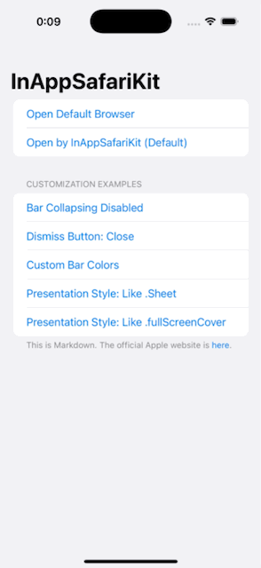
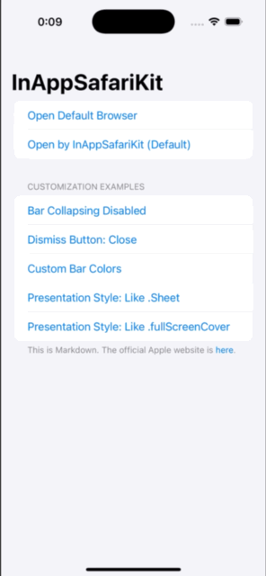

# InAppSafariKit

[](https://github.com/apple/swift-package-manager)

[日本語はこちら](README-ja.md)

A simple package for opening URLs within your app using `SFSafariViewController` in SwiftUI.  It allows you to open URLs, including those in `Link`, as in-app browsers using `SFSafariViewController`.


## Features

-   Opens URLs from `Link` within the app using `SFSafariViewController`.
-   Allows customization of various settings and presentation styles of `SFSafariViewController`.
-   Default settings can be changed with `@Environment(\.customSafariStyle)`.

## Requirements

-   iOS 15.0+
-   Xcode 16.0+

## Installation

You can install InAppSafariKit using Swift Package Manager (SPM).

1.  Open your project in Xcode.
2.  Select **File > Add Package Dependency...**
3.  Enter `https://github.com/Chronos2500/InAppSafariKit.git`.
4.  Set the version rule and other settings, then click **Add Package**.

## Usage

### Basic Usage

```swift
import SwiftUI
import InAppSafariKit

struct ContentView: View {
    private let url = URL(string: "https://www.apple.com")!
    var body: some View {
        NavigationStack{
            Form{
                Link("Open Default Browser", destination: url)
                Link("Open by InAppSafariKit (Default)", destination: url)
                    .OpenURLInAppSafari()
                
            }
        }
    }
}
```

Simply add the `.OpenURLInAppSafari()` modifier to a `Link` to open the link within the app using `SFSafariViewController`.
To apply it to all links within the app, add the `.OpenURLInAppSafari()` modifier to the parent View.
By default, `SFSafariViewController` is configured as follows:

-   `entersReaderIfAvailable`: `false`
-   `barCollapsingEnabled`: `true`
-   `dismissButtonStyle`: `.done`
-   `preferredBarTintColor`: `nil`
-   `preferredControlTintColor`: `nil`
-   `modalPresentationStyle`: `.fullScreen`

### Customization

You can customize the settings and presentation animation of `SFSafariViewController` using the `.OpenURLInAppSafari()` modifier.

```swift
Link("Custom Bar Colors", destination: url)
    .OpenURLInAppSafari(
        preferredBarTintColor: .purple,
        preferredControlTintColor: .white
    )
```

#### Customization Examples

<table>
  <tr>
    <td align="center"></td>
    <td align="center"></td>
  </tr>
  <tr>
    <td align="center">Open by InAppSafariKit (Default)</td>
    <td align="center"><code>preferredBarTintColor = .purple</code></td>
  </tr>
</table>

<table>
  <tr>
    <td align="center"></td>
    <td align="center"></td>
  </tr>
  <tr>
    <td align="center"><code>modalPresentationStyle = .pageSheet</code></td>
    <td align="center"><code>modalPresentationStyle = .overFullScreen</code></td>
  </tr>
</table>

### Default Settings

You can change the default style for child views and beyond by using the `customSafariStyle` environment variable on the parent view.

```swift
@main
struct InAppSafariKitExampleApp: App {
    var body: some Scene {
        WindowGroup {
            ContentView()
                .environment(\.customSafariStyle,CustomSafariStyle(dismissButtonStyle: .cancel,preferredBarTintColor: .gray))
        }
    }
}

```

## License

This project is released under the MIT License.

Chronos2500 © 2025

